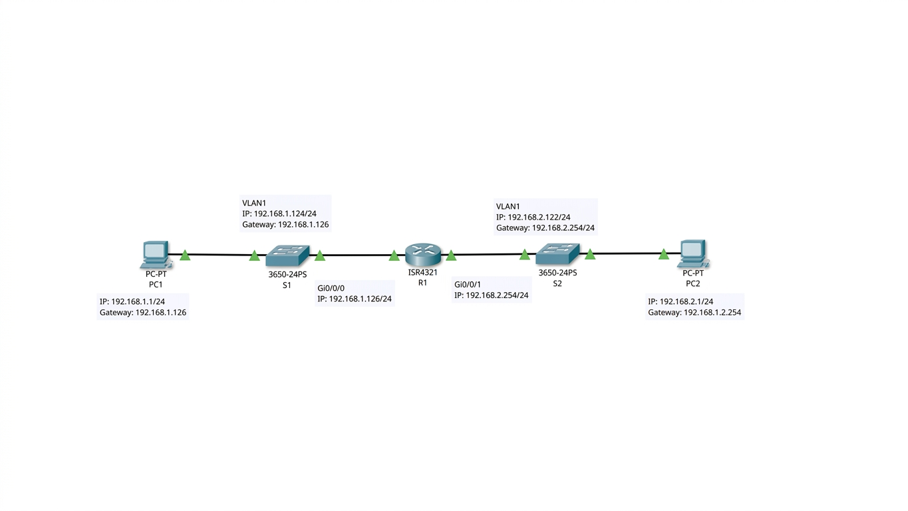

# CCNA Packet Tracer Labs

Hands-on Cisco Packet Tracer labs completed as part of CCNA exam preparation.

---

## Lab 1 — Basic Network Configuration & Troubleshooting

### Topology

### Devices Used
| Device | Model | Role |
|--------|-------|------|
| R1 | ISR4321 | Router (inter-subnet routing) |
| S1 | Catalyst 3650 | Access switch (192.168.1.0/24) |
| S2 | Catalyst 3650 | Access switch (192.168.2.0/24) |
| PC1 | PC-PT | End device — 192.168.1.1/24 |
| PC2 | PC-PT | End device — 192.168.2.1/24 |

### IP Addressing
| Device | Interface | IP Address | Mask | Gateway |
|--------|-----------|------------|------|---------|
| PC1 | NIC | 192.168.1.1 | /24 | 192.168.1.126 |
| PC2 | NIC | 192.168.2.1 | /24 | 192.168.2.254 |
| S1 | VLAN1 | 192.168.1.125 | /24 | 192.168.1.126 |
| S2 | VLAN1 | 192.168.2.122 | /24 | 192.168.2.254 |
| R1 | Gi0/0/0 | 192.168.1.126 | /24 | — |
| R1 | Gi0/0/1 | 192.168.2.254 | /24 | — |

### Issues Found & Fixed
- S1 VLAN1 had wrong subnet mask (/25 instead of /24)
- S2 VLAN1 was on wrong subnet (192.168.1.x instead of 192.168.2.x)
- PC2 had wrong IP and gateway for its physical location
- S2 Gi1/0/2 was in dynamic auto mode — changed to explicit access mode

### Verification
End-to-end ping between PC1 and PC2 across both subnets — **Successful**

### Files
- `CCNA_Lab_Report.docx` — full lab report with configs and analysis
- `ccna.pkt` — Packet Tracer source file

---

## Tools
- Cisco Packet Tracer
- Cisco IOS 16.x / 15.x
- Protocols: ICMP, CDP, STP PortFast

## Author
**nanahubert30** — BCT Computer Technology, KATH | CCNA in progress
